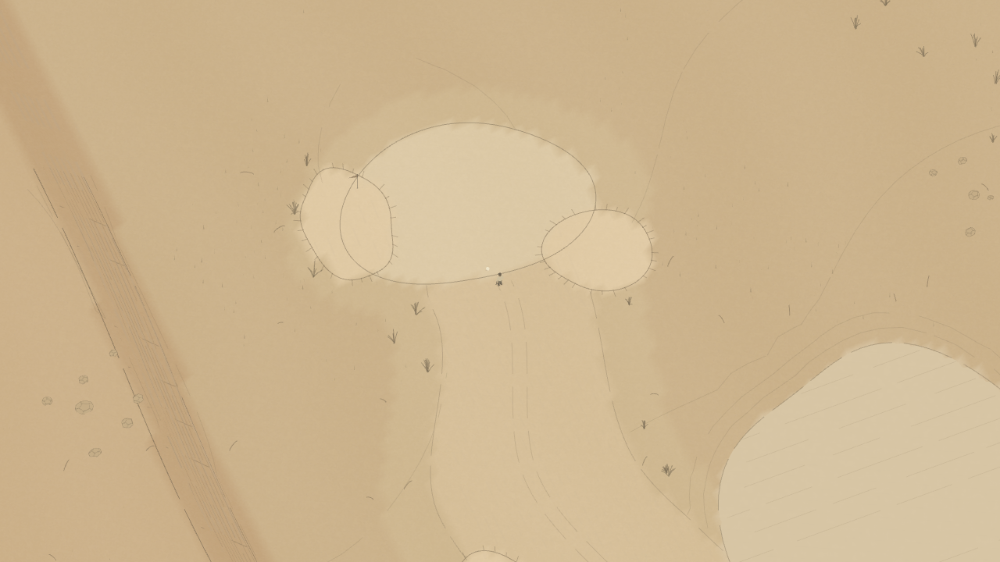

# Golf Exploration

A browser-native 3D golf landscape that plays like a living pencil drawing. The player can walk continuously, drive the cart, place and hit multiple balls, leave physical traces, lose a ball off-screen, find it again, and resume the same place after reloading. Normal play contains no HUD, score, minimap, aim line, or camera controls.



The implementation follows the immutable product, player-experience, art-direction, and engineering guides in [`founding-documents`](./founding-documents).

## Run it

```bash
npm install
npm run dev
```

Open the URL printed by Vite. The production build is created with `npm run build`.

## How to play

- Hold or drag on the landscape to walk toward the pointer.
- Use `WASD` or the arrow keys for keyboard movement; hold `Shift` for a brisk walk.
- Press `E` near a ball to enter stance. Drag and release on the landscape to swing; `A`/`D` make small body-alignment adjustments.
- Hold `B` to place another ball on nearby safe ground.
- Press `E` near the driver side of the cart to enter it. Use `W`/`S` to accelerate or reverse, `A`/`D` to steer, `Space` to brake, and `E` to park and exit.
- Press `Escape` outside stance to open the pause, controls, and accessibility sheet.

The camera always stays with the golfer. It never pans to a ball and cannot rotate or zoom. If a shot leaves the screen, walk or drive in its direction to find it.

Developer scenario controls remain available:

- `1` or `Space` while walking: deterministic fairway shot
- `2`: bunker shot
- `3`: water shot
- `4`: green approach
- `R`: reset the starting composition
- `F3`: diagnostics
- `P`: save immediately

## What is implemented

- A property-wide, versioned analytic field with seamless 48 m render/collision chunks and physical outer boundaries.
- Rapier kinematic collision for the golfer and cart, plus a custom deterministic 120 Hz multi-ball golf solver.
- Cursor-led traversal with local steering, surface resistance, slope limits, water/cliff safety, provisional foot grounding, and named locomotion events.
- A drivable, parkable cart with safe entry/exit and persistent paired tracks.
- Embodied ball acknowledgment, stance, body alignment, drag/release swing, named club impact, ball placement, cup capture, off-screen simulation, and rediscovery.
- IndexedDB sessions for golfer, cart, all retained balls, traces, world time/weather, and accessibility settings; denied storage falls back to a fully playable in-memory session.
- Persistent compact trace journals for footprints, cart tracks, divots, pitch marks, and sand marks.
- Procedural positional Web Audio for footsteps and physical impacts, unlocked only after a user gesture.
- Procedural grass, water, linework, birds, and shared deterministic wind/weather.
- Fixed high-angle orthographic rendering with no pan, rotation, zoom, or ball-follow path.
- A semantic pause/settings surface outside play with contrast, ball-size, reduced-motion, and stronger-sound options.
- WebGL context recovery, hidden/page lifecycle checkpoints, input cancellation, and phone-layout verification.

## Can the visual style change later?

Yes. Gameplay does not depend on the pencil renderer.

The authoritative property field, chunk streamer, Rapier world, golfer/cart controllers, ball solver, trace journal, session schema, input actions, and domain events are independent of the current Three.js materials and generated drawing marks. A future renderer can replace the paper palette, linework, grass, water, props, characters, or even the entire visual language while continuing to consume the same world samples and events.

The key rule is to preserve the contracts documented in [`docs/visual-style-contract.md`](./docs/visual-style-contract.md). A replacement renderer must keep visual terrain coincident with `propertyField`, keep world-space scale and coordinates, and preserve physical attachment points and named animation events. This permits a new shader style or authored golfer/cart GLBs without rewriting traversal, golf physics, persistence, or course data.

## Architecture

```text
Property blueprint + authoritative field
                |
        deterministic chunk streamer
          /             |             \
 Three.js renderer   Rapier world   trace journals
          \             |             /
      golfer/cart controllers + multi-ball solver
                       |
        domain events, audio, IndexedDB session
```

Important source boundaries:

- `src/world`: property schema, field, chunks, traces, and environment
- `src/physics`: streamed Rapier collision/query world and kinematic agents
- `src/simulation`: golfer, cart, and golf-ball state machines
- `src/render`: replaceable illustrated renderer, provisional figures, marks, and ambient life
- `src/audio`: replaceable event-driven Web Audio presentation
- `src/persistence`: versioned world-session storage and graceful fallback
- `src/main.ts`: lifecycle and typed orchestration

See [`docs/implementation-status.md`](./docs/implementation-status.md) for milestone evidence and remaining production work.

## Validation

```bash
npm run build
npm run screenshots
npm run verify:foundation
npm run verify:traversal
npm run verify:golf
npm run verify:environment
npm run verify:first-playable
npm run verify:ambient
```

The browser suites use deterministic scenarios in Chromium with software WebGL and write ignored review images to `artifacts/screenshots/`. They verify renderer/physics agreement, chunk transitions, persistence, camera invariants, walking and cart safety, swing/multi-ball behavior, environmental memory, accessibility, context recovery, denied storage, and ambient breadth.

## Honest production gaps

The current golfer and cart are code-generated provisional figures. The architecture is ready for the two approved authored `.glb` assets, but final modeling, rigging, clips, and animation-event metadata are not included. Procedural Web Audio proves the spatial/event architecture but should be supplemented with restrained authored recordings. The development course editor and worker-based chunk generation from the founding architecture are not yet built. Rapier is asynchronously split from the initial app code, but its compatibility bundle is still large. Real iOS/Android hardware, assistive technology, and broader browser/device testing remain necessary before a public release.
